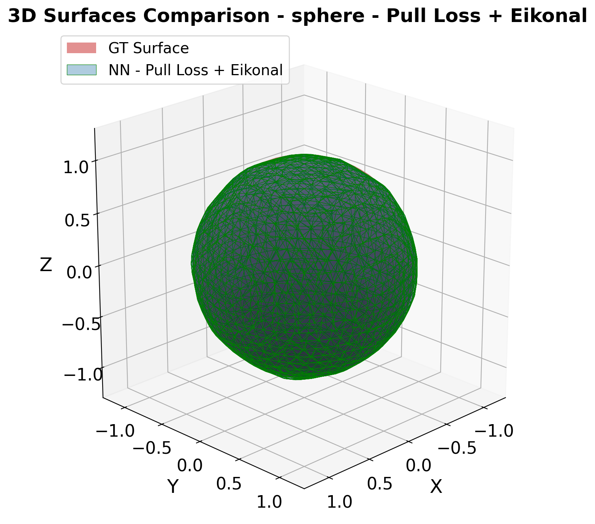
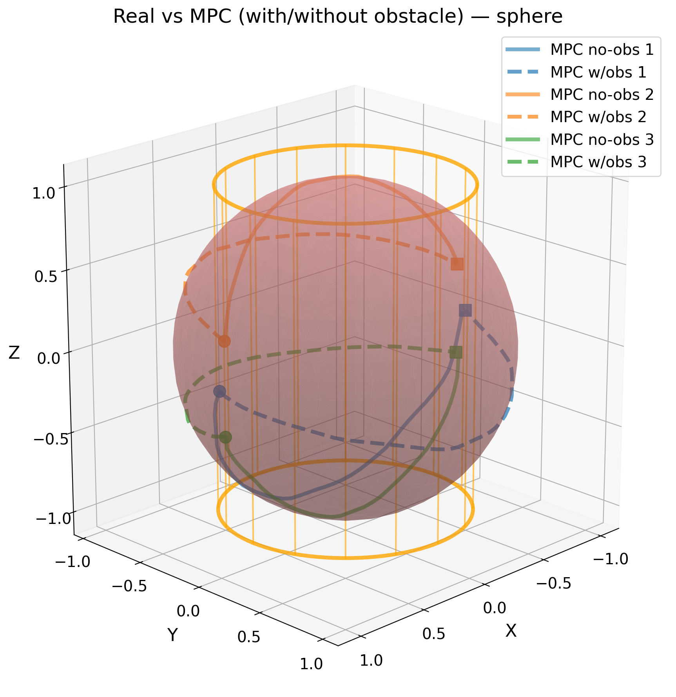

# Learning Equality Constraints from Demonstrations

PyTorch research prototype for learning geometric equality constraints from trajectory demonstrations and using them for projection-based, constraint-aware motion planning.

This repository contains my research implementation and experimental utilities for learning geometric equality constraints from trajectory demonstrations. It focuses on learning explicit neural constraint functions and using them for projection-based correction and constraint-aware motion generation.

## Overview

The project learns a differentiable scalar constraint function from demonstrated states. Feasible states are represented by the zero-level set of the learned function:

```text
h(x) = 0
```

Instead of only imitating trajectory positions, the code estimates the underlying geometric surface or curve that constrains the motion. The learned constraint can then be used to project predicted trajectories back to the feasible set and to support simple constraint-aware planning experiments.

The repository is structured as a research prototype developed during a research internship. It is not presented as an official implementation of any publication. Manuscript files, submission materials, and non-public research artifacts are intentionally not included.

## Main Features

- Synthetic 2D and 3D constraint generation for curves and surfaces.
- Positive and negative sample generation from demonstrated trajectories.
- PyTorch implicit models for learning neural zero-level set constraints.
- Margin, k-NN-style, Neural Pull, and ECoMaNN-inspired losses.
- L2 and Eikonal regularization utilities for learned implicit functions.
- Projection-based correction of off-manifold trajectory predictions.
- Imitation controller, QP, and MPC-style trajectory generation experiments.
- Evaluation scripts for geometric reconstruction and trajectory tracking.
- Selected compressed figures in `assets/` for lightweight GitHub documentation.

## Repository Structure

```text
.
|-- assets/                  # Selected lightweight figures for README/docs
|-- examples/                # Small usage notes; no datasets or checkpoints
|-- project/
|   |-- configs/             # 2D and 3D experiment configuration files
|   |-- experiments/         # Research scripts for 2D/3D experiments
|   |-- requirements.txt     # Minimal Python dependencies
|   `-- src/
|       |-- data/            # Constraint definitions and sampling helpers
|       |-- losses/          # Training losses and regularizers
|       |-- models/          # Implicit models, controller, and MPC modules
|       |-- training/        # Training and evaluation loops
|       `-- utils/           # Metrics, plotting, projection, and seed helpers
|-- .gitignore
`-- README.md
```

Generated experiment folders such as `outputs/`, `controller_outputs/`, `results_summary/`, model checkpoints, videos, logs, and reports are excluded from the public release.

## Installation

Use Python 3.10 or newer. A virtual environment is recommended.

```bash
cd project
python -m venv .venv
```

On Windows PowerShell:

```powershell
.\.venv\Scripts\Activate.ps1
pip install -r requirements.txt
```

On macOS or Linux:

```bash
source .venv/bin/activate
pip install -r requirements.txt
```

The code uses PyTorch, NumPy, Matplotlib, PyYAML, scikit-image, scikit-learn, and OSQP. Install the PyTorch build appropriate for your CPU/CUDA setup if the default `pip` package is not suitable.

## Quick Start

Run commands from the `project/` directory.

Train a 3D implicit surface model on synthetic trajectory samples:

```bash
python experiments/3D/main_3d.py --constraint sphere --dataset trajectory --traj-num 35 --traj-points 25 --regularizer eikonal --no-show
```

Run a 2D comparison experiment:

```bash
python "experiments/2D/exp-knn-npl&comparison/knn-npl.py"
```

Run controller or planning experiments on a learned 3D constraint:

```bash
python experiments/3D/cont.py --constraint sphere --cont --no-show
python experiments/3D/cont.py --constraint sphere --mpc --no-show
```

Run the PCA negative-sampling comparison:

```bash
python experiments/3D/PCA_comparison/main_simple.py
```

These scripts create generated outputs under experiment-specific folders. Those artifacts are ignored by Git so that the public repository stays lightweight.

## Example Results

Selected figures are kept in `assets/` as small representative examples.

### Learned Surface Reconstruction



### Projection-Based Trajectory Correction


### Constraint-Aware Motion Planning



### Trajectory Tracking


## Status

This is research code rather than a polished library. The source structure is intentionally preserved to reflect the original experimental workflow. Some scripts are specific to the experiments they were written for, and generated artifacts are excluded from version control.

Known release notes:

- The repository keeps code, small configs, and selected figures only.
- Large generated outputs, checkpoints, videos, reports, and raw experiment folders are ignored or moved outside the release tree.
- No private manuscript, submission, or confidential lab materials are included.
- Add a license before public reuse if one is required for your release.

## License / Citation

No license file is included in this snapshot. Add the intended license before publishing if others should be allowed to reuse the code.

If you use or build on this implementation, please cite the repository or the associated public research output once available.
