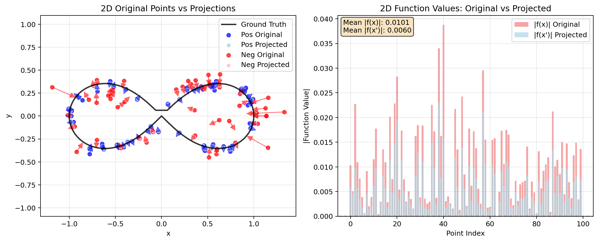
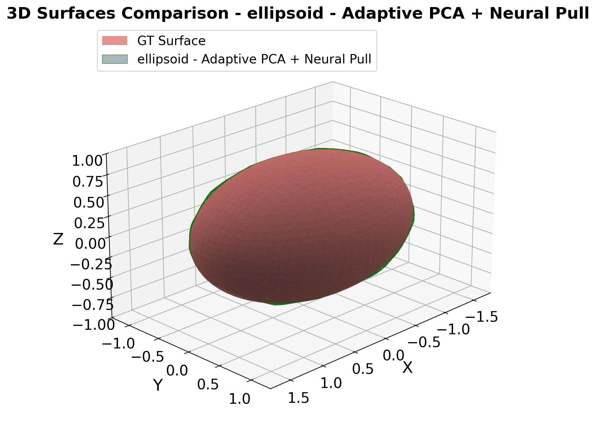
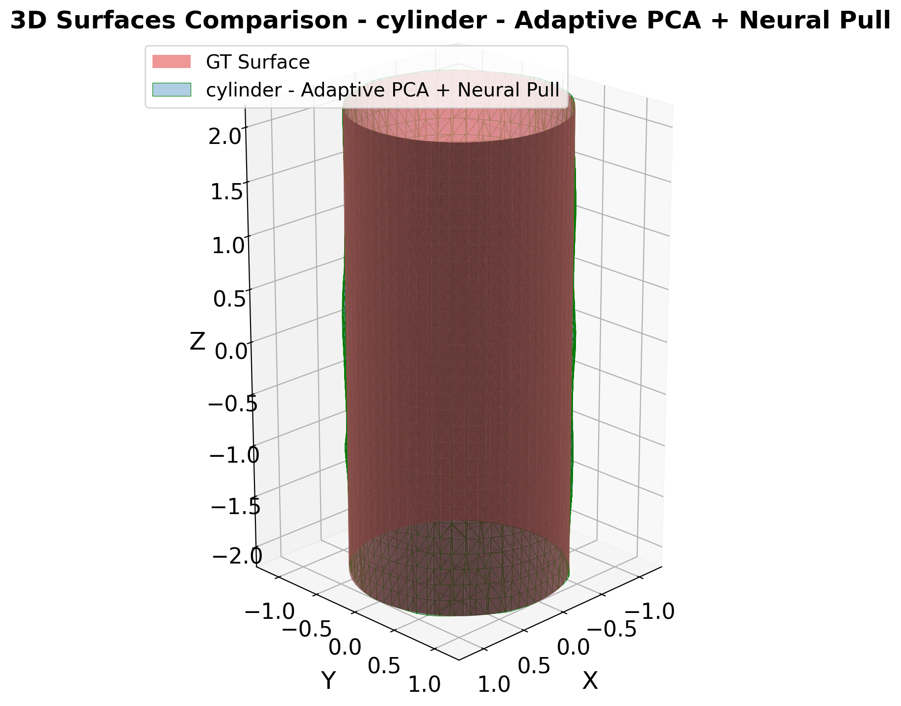
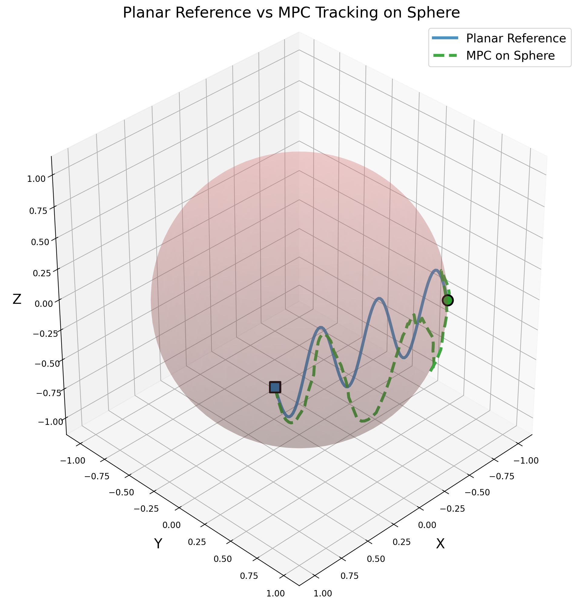

# Learning Equality Constraints from Demonstrations

PyTorch research prototype for learning geometric equality constraints from trajectory demonstrations and using them for projection-based, constraint-aware motion planning.

This repository contains my research implementation and experimental utilities for learning explicit neural constraint functions from demonstrations. The learned constraint is represented as the zero-level set of a differentiable function:

```text
h(x) = 0
```

The codebase focuses on synthetic 2D/3D geometric constraints, neural implicit models, projection-based trajectory correction, and lightweight planning experiments. It was developed during a research internship and is shared as a research prototype, not as an official implementation of a publication. Manuscript files, submission materials, and non-public research artifacts are intentionally not included.

## Overview

The central idea is to recover the geometric constraint behind demonstrated trajectories. Demonstration points are treated as samples on a feasible curve or surface, while auxiliary off-surface samples help train a scalar implicit function. Once learned, the constraint can be used to:

- reconstruct the feasible geometry as a zero-level set;
- project off-manifold predictions back toward the learned constraint;
- compare different implicit learning losses and regularizers;
- run simple constraint-aware control and planning experiments.

## Main Features

- Synthetic 2D and 3D constraint generation for curves and surfaces.
- Demonstration-style trajectory sampling.
- Positive and negative sample generation, including PCA-based local normal estimates.
- PyTorch implicit models for neural zero-level set learning.
- Margin, k-NN-style, Neural Pull, and ECoMaNN-inspired losses.
- L2 and Eikonal regularization utilities.
- Projection-based trajectory correction.
- Imitation controller, QP, and MPC-style motion generation scripts.
- Evaluation and plotting utilities for reconstruction and trajectory behavior.
- Curated lightweight result gallery in `assets/`.

## Repository Structure

```text
.
|-- assets/                  # Curated result figures for GitHub/docs
|-- docs/                    # Result notes and release documentation
|-- examples/                # Small public usage notes
|-- project/
|   |-- configs/             # 2D and 3D experiment configuration files
|   |-- experiments/         # Research scripts for 2D/3D experiments
|   |-- requirements.txt     # Minimal Python dependencies
|   `-- src/
|       |-- data/            # Constraint definitions and sampling helpers
|       |-- losses/          # Training losses and regularizers
|       |-- models/          # Implicit models, controller, and MPC modules
|       |-- training/        # Training and evaluation loops
|       `-- utils/           # Metrics, plotting, projection, and seed helpers
|-- .gitignore
`-- README.md
```

Generated experiment folders such as `outputs/`, `controller_outputs/`, `results_summary/`, model checkpoints, videos, logs, and reports are excluded from the public release.

## Installation

Use Python 3.10 or newer. A virtual environment is recommended.

```bash
cd project
python -m venv .venv
```

Windows PowerShell:

```powershell
.\.venv\Scripts\Activate.ps1
pip install -r requirements.txt
```

macOS / Linux:

```bash
source .venv/bin/activate
pip install -r requirements.txt
```

The project uses PyTorch, NumPy, Matplotlib, PyYAML, scikit-image, scikit-learn, and OSQP. Install the PyTorch build appropriate for your CPU/CUDA setup if the default package is not suitable.

## Quick Start

Run commands from the `project/` directory.

Train a 3D implicit surface model on synthetic trajectory samples:

```bash
python experiments/3D/main_3d.py --constraint sphere --dataset trajectory --traj-num 35 --traj-points 25 --regularizer eikonal --no-show
```

Run a 2D comparison experiment:

```bash
python "experiments/2D/exp-knn-npl&comparison/knn-npl.py"
```

Run controller or planning experiments on a learned 3D constraint:

```bash
python experiments/3D/cont.py --constraint sphere --cont --no-show
python experiments/3D/cont.py --constraint sphere --mpc --no-show
```

Run the PCA negative-sampling comparison:

```bash
python experiments/3D/PCA_comparison/main_simple.py
```

These scripts create generated outputs under experiment-specific folders. Those artifacts are ignored by Git so the repository stays lightweight.

## Example Results

Selected figures are included in `assets/`. More context is available in [docs/RESULTS.md](docs/RESULTS.md).

| Learned surfaces | Projection and planning |
| --- | --- |
|  |  |
|  |  |
|  |  |

Additional result snapshots:

- [2D learned level sets](assets/2d_level_sets.png)
- [2D training curves](assets/2d_training_curves.png)
- [Ellipsoid motion planning](assets/ellipsoid_motion_planning.png)
- [Cylinder motion planning](assets/cylinder_motion_planning.png)

## Status

This is research code rather than a polished Python package. The source structure is intentionally preserved to reflect the original experimental workflow. Some scripts are experiment-specific, and generated artifacts are excluded from version control.

Public release choices:

- Keep code, configs, small examples, and selected result figures.
- Exclude large generated outputs, checkpoints, videos, raw experiment folders, reports, and private materials.
- Keep the repository lightweight enough to clone and inspect easily.
- Store any full experiment archive separately if needed.

## License / Citation

No license file is included in this snapshot. Add the intended license before publishing if others should be allowed to reuse the code.

If you use or build on this implementation, please cite the repository or the associated public research output once available.
