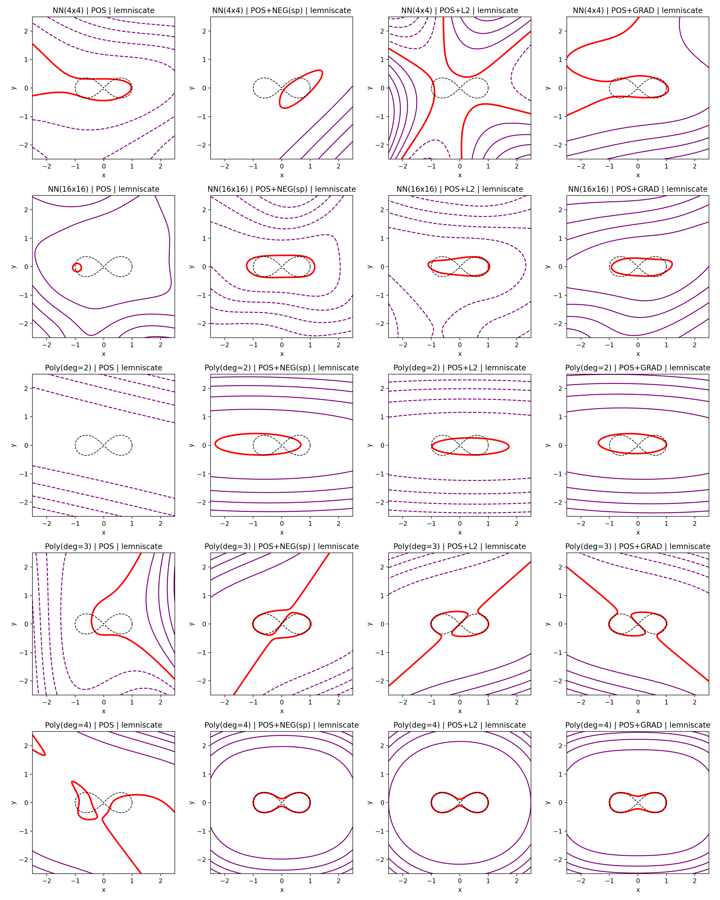
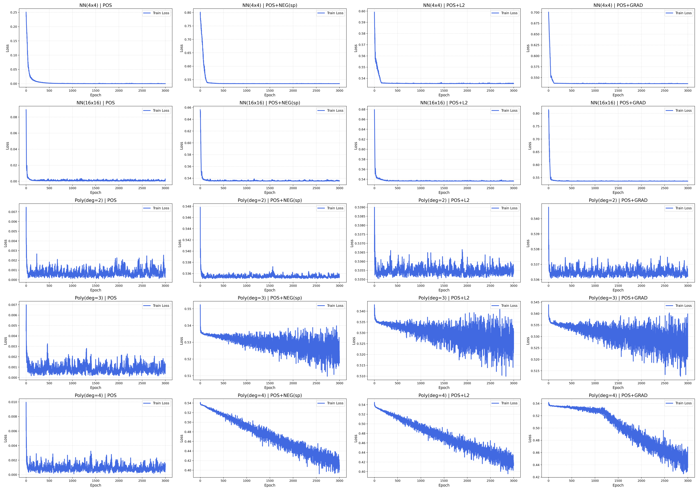
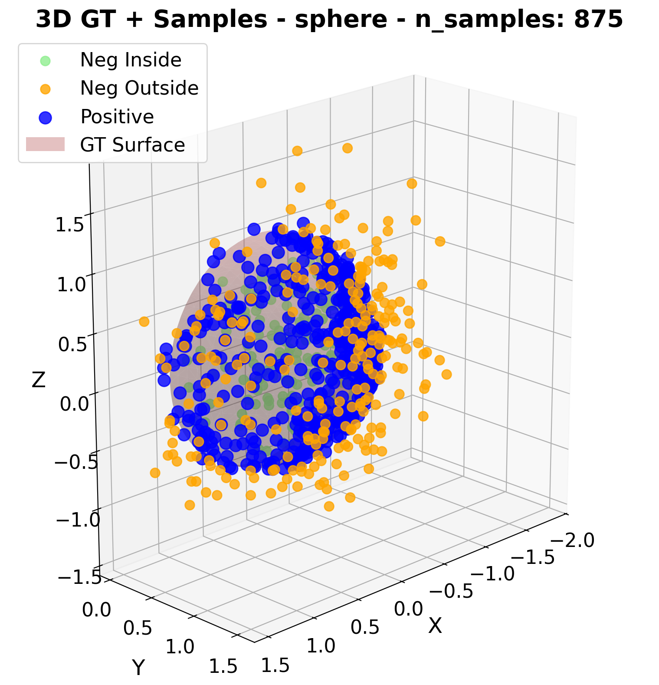
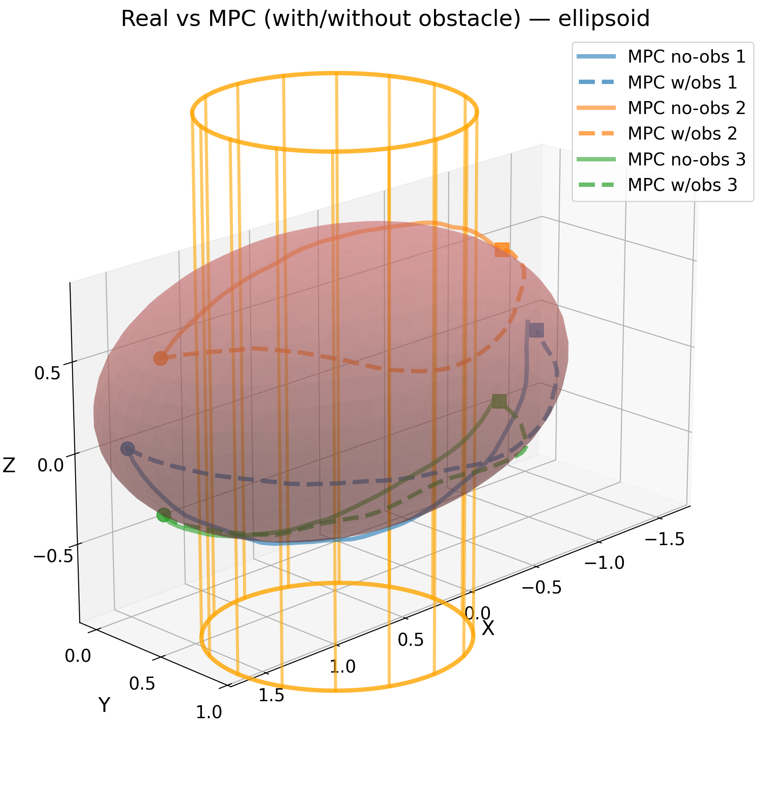
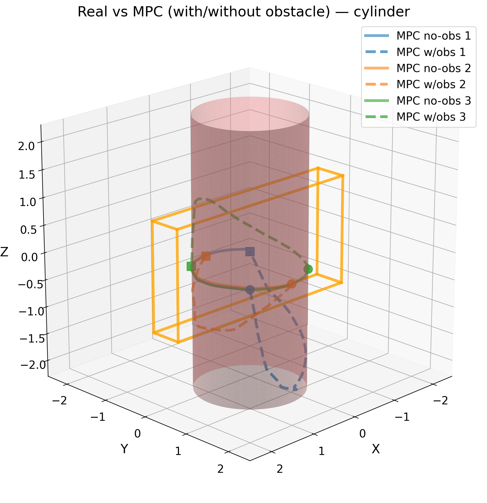

# Selected Results

This page documents the curated figures included in `assets/`. The full generated experiment outputs are intentionally not tracked in Git.

## Surface Learning

The project learns implicit neural constraints whose zero-level set approximates the demonstrated geometry.

| Figure | Description |
| --- | --- |
|  | Sphere reconstruction from trajectory-style samples using an implicit neural model. |
|  | Ellipsoid reconstruction example from the 3D PCA negative-sampling comparison. |
|  | Cylinder reconstruction example from the 3D PCA negative-sampling comparison. |

## 2D Experiments

The 2D scripts are useful for quickly inspecting learned level sets, loss behavior, and projection effects.

| Figure | Description |
| --- | --- |
|  | Learned level sets for the 2D comparison experiment. |
|  | Training curves from the 2D loss comparison. |
|  | Projection-based correction of off-manifold 2D points. |

## PCA-Based Negative Sampling

Negative samples are generated around demonstrated trajectories using local normal estimates. This gives the implicit model off-surface supervision while keeping the source demonstrations on the target geometry.

| Figure | Description |
| --- | --- |
|  | Positive and generated samples used for 3D constraint learning. |

## Motion Generation

After learning a constraint, the project evaluates trajectory correction and simple constrained motion generation.

| Figure | Description |
| --- | --- |
|  | Constraint-aware planning comparison on a sphere. |
|  | Constraint-aware planning comparison on an ellipsoid. |
|  | Constraint-aware planning comparison on a cylinder. |
|  | Tracking example comparing raw and constrained motion behavior. |

## What Is Not Included

The public repository excludes:

- full `outputs/` and `controller_outputs/` trees;
- trained checkpoints and serialized models;
- generated CSV summaries;
- GIFs and videos;
- PDFs and internal reports;
- manuscript or submission material.

Those artifacts can be archived separately if a full reproducibility bundle is needed.
